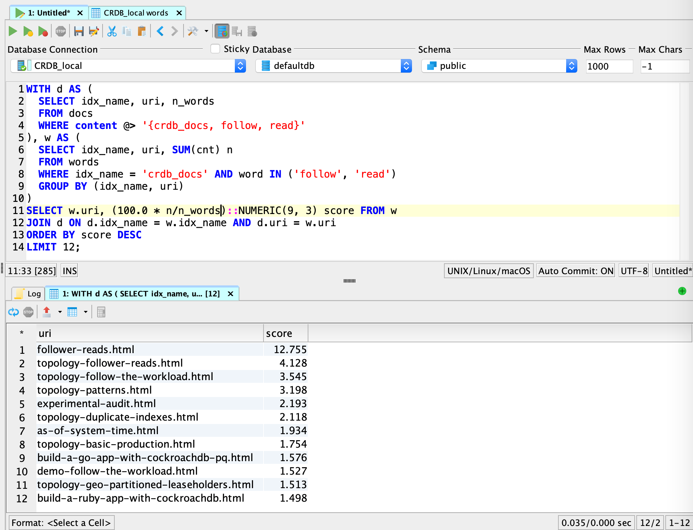

# Example: Text Search in CockroachDB



This is a simple example of doing full text indexing and search on a set of
HTML documents.  What is shown here is based on Ubuntu 18.04 (running on a
locally deployed VM), and I am assuming a CockroachDB instance is running on
the network, in insecure mode.  My experimental setup uses a 3 node CockroachDB
instance with HAProxy listening on port 5432 (the traditional PostgreSQL port),
all running locally on a MacBook Pro.

## Prerequisites

* The [Psycopg ](https://www.psycopg.org/docs/) PostgreSQL driver for Python:
```
$ pip install --user -U psycopg2
```

* [Beautiful Soup](https://www.crummy.com/software/BeautifulSoup/bs4/doc/#quick-start),
a Python library for working with HTML documents:
```
$ sudo apt-get install python3-bs4
```

* The _Pip_ Python package installer:
```
$ sudo apt install python-pip
```

* [Natural Language Toolkit (NLTK)](https://www.nltk.org/), a leading platform
for building Python programs to work with human language data:
```
$ pip install --user -U nltk
```

* Install a couple of supporting data files, for NLTK:
```
$ python -c 'import nltk; nltk.download("stopwords");'

```

* Data: a set of HTML documents to index.  If you'd like to try the ones used in my demo,
you can grab them like so (assuming _wget_ is installed):
```
wget -O - https://github.com/mgoddard/crdb-text-search/raw/master/crdb-v20.2-docs.tar.gz | tar xzvf -
```

* A SQL client to connect to the CockroachDB cluster.  I did all my SQL using
[DbVisualizer](https://www.dbvis.com/download/11.0), a Java based GUI SQL client, running on my MacBook Pro.

## The Demo

* Using your SQL client, build the tables and indexes using the [provided SQL](./crdb_text_search.sql)

* The `tar xzvf -` up above should have created the `crdb-v20.2-docs`.  Change into that directory:
```
$ cd crdb-v20.2-docs
```

* Set the two environment variables required to connect, substituting the appropriate values.  If you
aren't using HAProxy, the `PGPORT` value is probably going to be `26257`:
```
$ export PGHOST=192.168.1.4
$ export PGPORT=5432
```

* Run the indexing step:
```
mgoddard@ubuntu:~/crdb-v20.2-docs$ ../crdb-text-search/html_indexer.py crdb_docs *.html
Indexing file 404.html now ...
Indexing file add-column.html now ...
Indexing file add-constraint.html now ...
Indexing file admin-ui-access-and-navigate.html now ...
Indexing file admin-ui-cdc-dashboard.html now ...
Indexing file admin-ui-cluster-overview-page.html now ...
Indexing file admin-ui-custom-chart-debug-page.html now ...
Indexing file admin-ui-databases-page.html now ...
[...]
Indexing file views.html now ...
Indexing file view-version-details.html now ...
Indexing file window-functions.html now ...
Total time: 107.10261821746826 s
```

* Using your SQL client, try the example query:
```sql
WITH d AS (
  SELECT idx_name, uri, n_words
  FROM docs
  WHERE content @> '{crdb_docs, follow, read}'
), w AS (
  SELECT idx_name, uri, SUM(cnt) n
  FROM words
  WHERE idx_name = 'crdb_docs' AND word IN ('follow', 'read')
  GROUP BY (idx_name, uri)
)
SELECT w.uri, (100.0 * n/n_words)::NUMERIC(9, 3) score FROM w
JOIN d ON d.idx_name = w.idx_name AND d.uri = w.uri
ORDER BY score DESC
LIMIT 12;
```

* Try some different queries.  Since each of our indexed words was transformed by stemming,
you'll want to do the same with your query terms; e.g.
```
mgoddard@ubuntu:~/crdb-v20.2-docs$ python
Python 3.6.9 (default, Jul 17 2020, 12:50:27)
[GCC 8.4.0] on linux
Type "help", "copyright", "credits" or "license" for more information.
>>> import nltk
>>> sno = nltk.stem.SnowballStemmer("english")
>>> sno.stem("installing")
'instal'
>>> sno.stem("insecure")
'insecur'
```

* Use these stemmed terms in your revised SQL query:
```sql
WITH d AS (
  SELECT idx_name, uri, n_words
  FROM docs
  WHERE content @> '{crdb_docs, instal, insecur}'
), w AS (
  SELECT idx_name, uri, SUM(cnt) n
  FROM words
  WHERE idx_name = 'crdb_docs' AND word IN ('instal', 'insecur')
  GROUP BY (idx_name, uri)
)
SELECT w.uri, (100.0 * n/n_words)::NUMERIC(9, 3) score FROM w
JOIN d ON d.idx_name = w.idx_name AND d.uri = w.uri
ORDER BY score DESC
LIMIT 12;
```

## Try the Docker image

* Show how to run the Docker image
* Run the DDL
* Index some docs
* Loop over searches, while adding more docs

## Ideas for what to do next

* Improve relevance calculations
* N-grams?
* Synomyms?
* Store the text in the `docs` table to support phrase matching?  How does this impact the size of the data being stored?

## References

[Set up a local CockroachDB cluster](https://www.cockroachlabs.com/docs/stable/start-a-local-cluster.html)

[HAProxy setup](https://www.cockroachlabs.com/docs/stable/deploy-cockroachdb-on-premises-insecure.html#step-5-set-up-load-balancing)

[PostgreSQL libpq environment varables](https://www.postgresql.org/docs/current/libpq-envars.html)

[Building the container](https://buildpacks.io/docs/app-developer-guide/build-an-app/)

